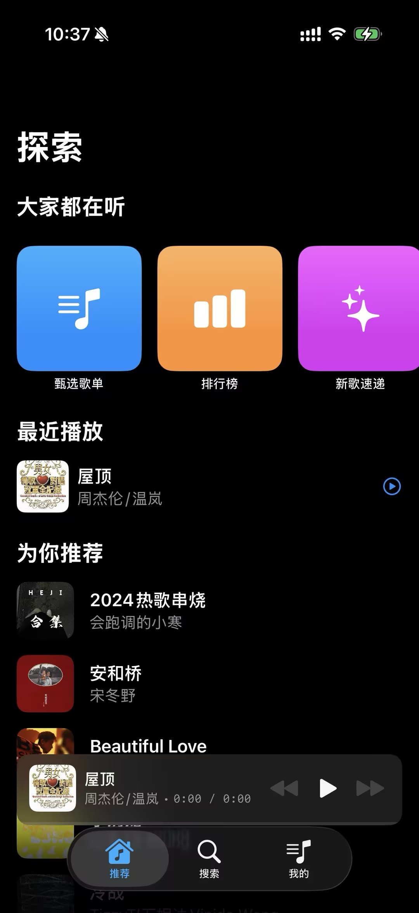
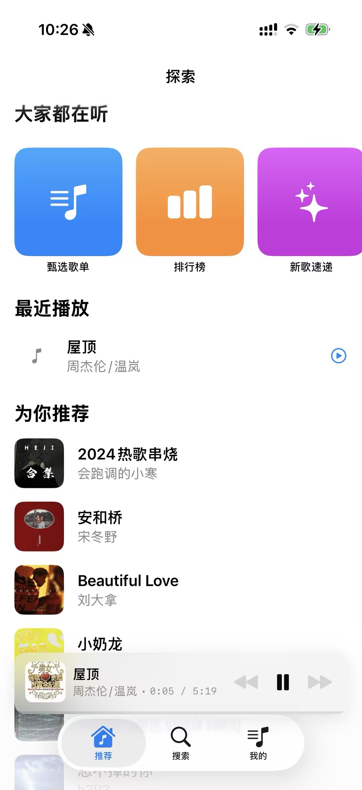
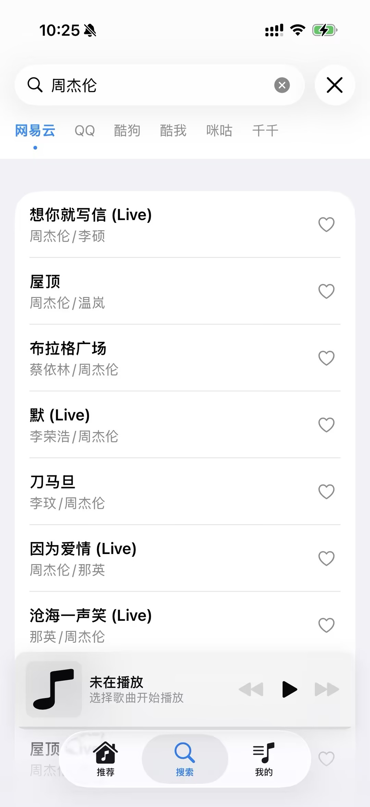
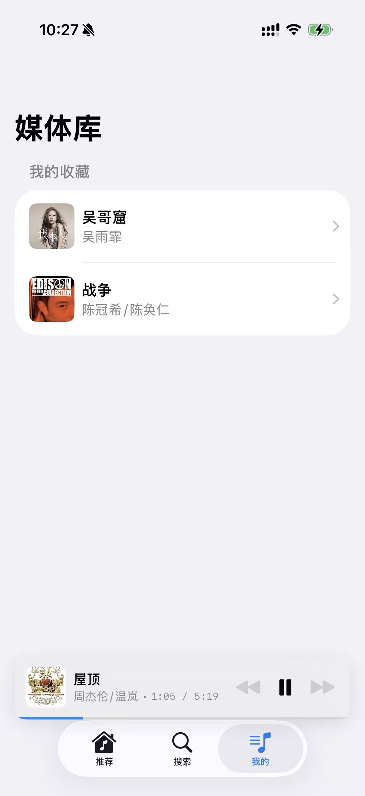

# Xmusic

A modern, native iOS music player built with SwiftUI.

## Features

- **Native Experience**: Built with SwiftUI for a smooth and responsive user interface.
- **Advanced Playback**:
  - Background playback support
  - Mini player with quick controls
  - Queue management (Previous/Next track)
- **Lyrics System**: Automatic scrolling lyrics with time-sync.
- **Library Management**:
  - Recent Play History (with auto-deduplication)
  - Favorites System
- **Modern UI**:
  - Elegant dark mode design
  - Blur effects and animations
  - Swipe actions for list management

## Requirements

- iOS 15.0+
- Xcode 14.0+
- Swift 5.0+

## Installation

1. Clone the repository.
2. Open `Xmusic.xcodeproj` in Xcode.
3. Build and run on your simulator or device.

## Usage

1. **Search & Play**: Search for songs and play them instantly.
2. **Manage**: Add songs to favorites or check your listening history.

## Development

The project structure is organized as follows:

- `Sources/`: Main source code directory.
  - `Views/`: SwiftUI views (PlayerView, HomeView, etc.)
  - `Models/`: Data models (SwiftData entities)
  - `Services/`: Logic controllers (PlayerManager, MusicApiService, etc.)
  - `Resources/`: Assets and other resources.

## License

This project is licensed under the MIT License - see the [LICENSE](LICENSE) file for details.
